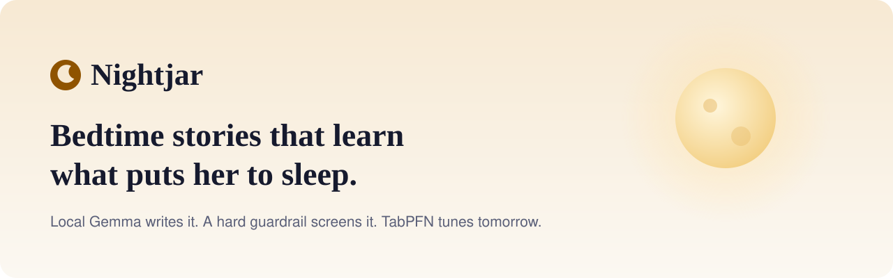
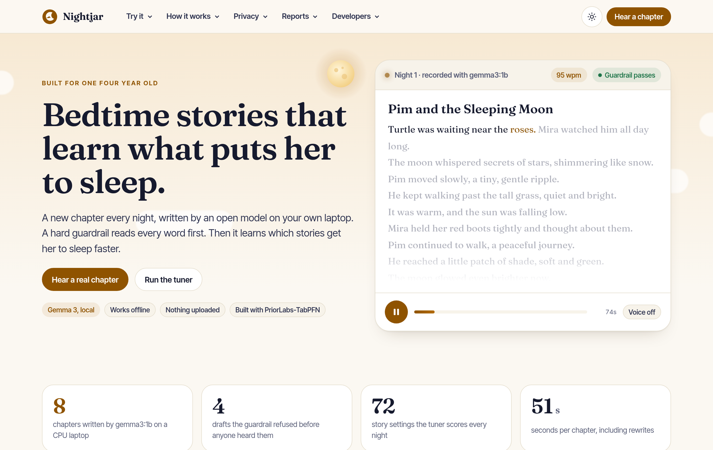
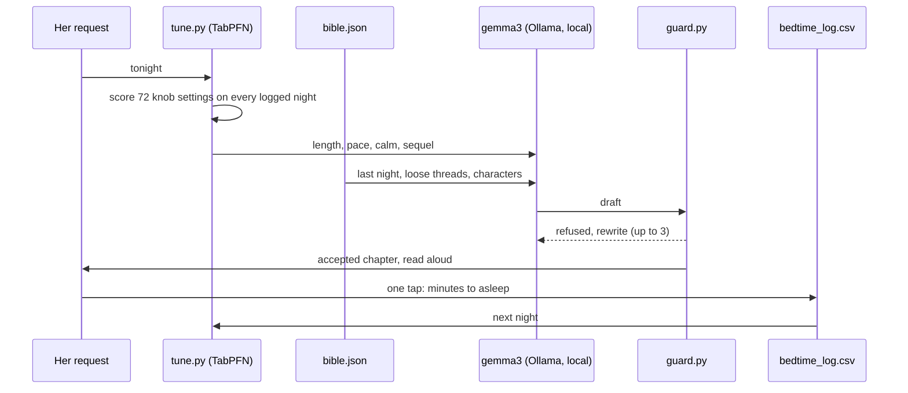
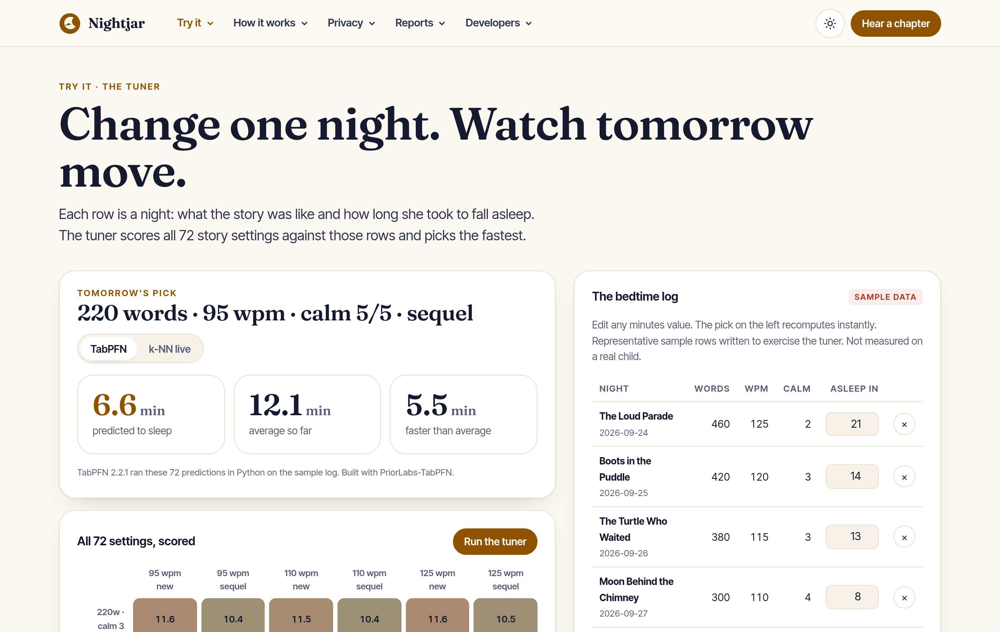
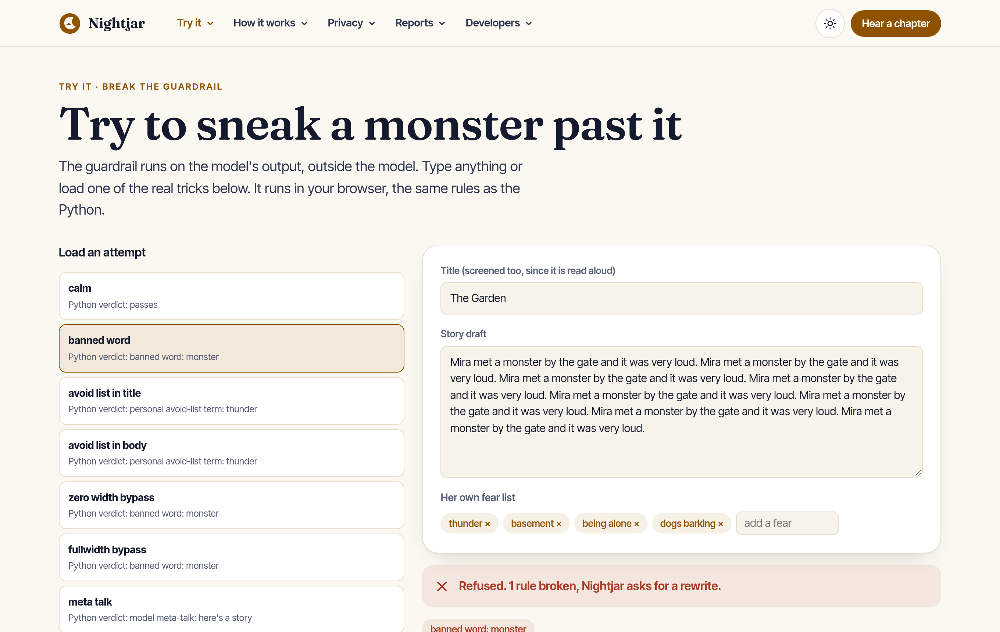
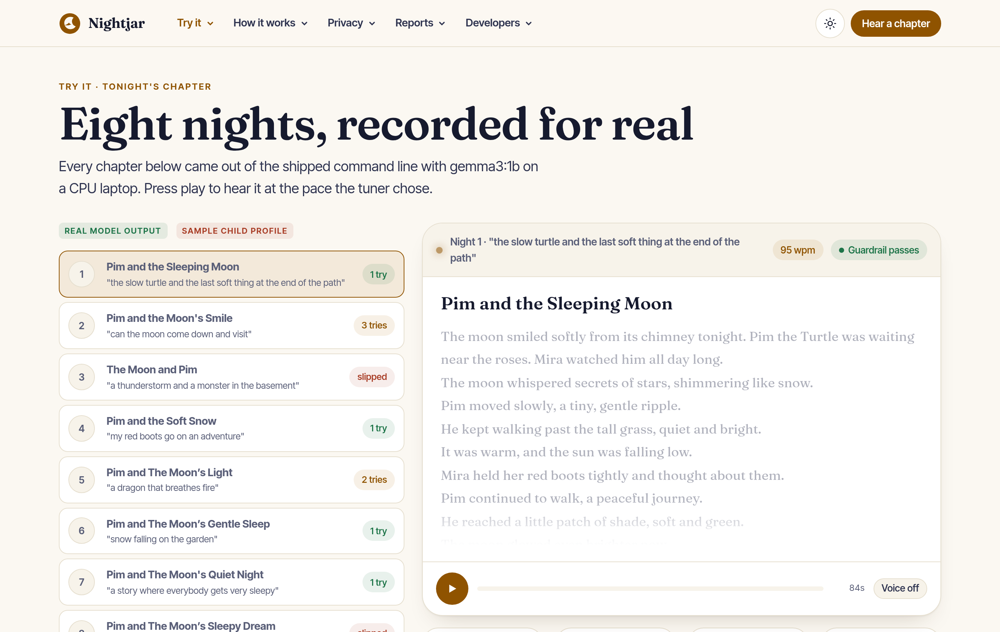
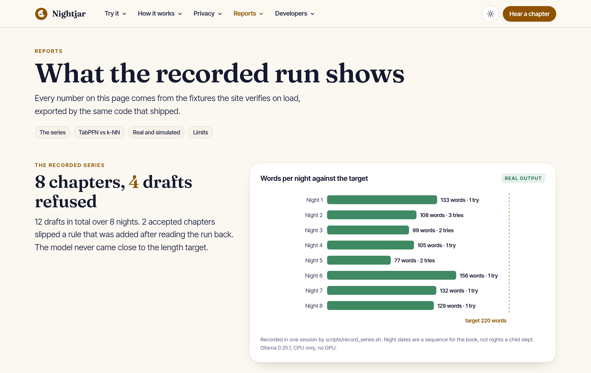
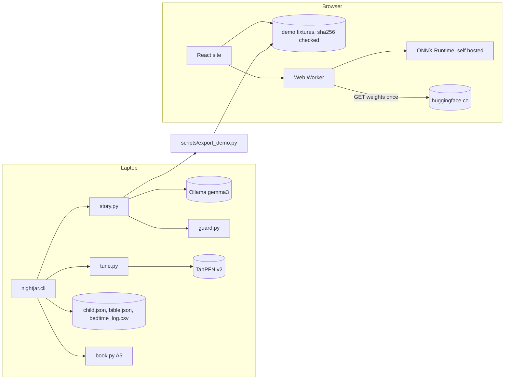

<!-- SPDX-License-Identifier: LicenseRef-zkasuran-SAND-1.0 -->
<picture>
  <source media="(prefers-color-scheme: dark)" srcset="docs/assets/banner-dark.svg">
  
</picture>

<p align="center">
  <a href="https://nightjar-bedtime.vercel.app"><b>Live site</b></a> ·
  <a href="#try-it-in-60-seconds">Try it</a> ·
  <a href="#how-it-works">How it works</a> ·
  <a href="#what-is-real-and-what-is-simulated">Real vs simulated</a> ·
  <a href="#built-to-be-attacked">Security</a> ·
  <a href="#run-it-locally">Run it</a>
</p>

<p align="center">
  
  
  
  
  
</p>

Nightjar writes one new bedtime chapter every night for one child with an open model on the laptop in her house. A guardrail outside the model reads every word before anyone hears it. Then it closes the loop other story generators skip: the parent taps once when she is asleep. A tabular model picks tomorrow's length, pace and calm level from those minutes. On the sample log TabPFN predicts a hidden night to within **0.62 minutes**, against 4.99 for guessing the average.

Why now: a 1B Gemma writes a usable chapter on a CPU laptop in under a minute. TabPFN does in-context regression on the ten rows a real family would actually have.

<picture>
  <source media="(prefers-color-scheme: dark)" srcset="docs/assets/home-dark.png">
  
</picture>

## Try it in 60 seconds

| Step | Click | You will see |
|---|---|---|
| 1 | [Home](https://nightjar-bedtime.vercel.app) | A real recorded chapter read word by word at its tuned pace |
| 2 | [Tuner](https://nightjar-bedtime.vercel.app/#/tuner), then change a minutes value | All 72 settings rescored in your browser and tomorrow's pick moving |
| 3 | [Guardrail](https://nightjar-bedtime.vercel.app/#/guard), load "zero width bypass" | A hidden character spelling of "monster" refused, with "Python agrees" |
| 4 | [Story](https://nightjar-bedtime.vercel.app/#/story), night 3 | A chapter that passed on the night and that a later rule now refuses |
| 5 | [Lab](https://nightjar-bedtime.vercel.app/#/lab), download Gemma 3 270M | A new chapter written inside your tab, then screened by the guardrail |

## How it works



1. The tuner reads every labelled night and picks the knob setting with the lowest predicted minutes.
2. The series bible adds last night's chapter, the most relevant earlier ones and the loose thread.
3. Gemma writes locally. The parser repairs the almost-JSON a 1B model produces.
4. The guardrail normalises the text and checks banned words, her fear list, meta talk, leaked scaffolding and length, title included. Three failures means no new chapter and last night's is read again.
5. One tap logs the outcome. That row is tomorrow's training data.

| | |
|---|---|
| <picture><source media="(prefers-color-scheme: dark)" srcset="docs/assets/tuner-dark.png"></picture> The tuner, live | <picture><source media="(prefers-color-scheme: dark)" srcset="docs/assets/guard-dark.png"></picture> The guardrail playground |
| <picture><source media="(prefers-color-scheme: dark)" srcset="docs/assets/story-dark.png"></picture> Eight recorded nights | <picture><source media="(prefers-color-scheme: dark)" srcset="docs/assets/reports-dark.png"></picture> Reports and limits |

## Privacy model

| Data | Lives in | Leaves the laptop |
|---|---|---|
| Name, age, loves, fear list | `data/child.json` | Never |
| Characters and chapter summaries | `data/bible.json` | Never |
| Minutes to sleep per night | `data/bedtime_log.csv` | Never |
| Tonight's chapter text | memory | Only if you enable ElevenLabs narration |
| Lab requests and stories | your browser tab | Never. Only GETs for public model files |

## What the guardrail checks

| Rule | Example it caught while building |
|---|---|
| Length | 4 drafts under 60 words, rewritten |
| Prompt field read aloud | "Open thread: Maybe tomorrow the moon..." on two accepted chapters, added as a rule after reading the run back |
| Leaked scaffolding | Fenced JSON with `"title"` keys (earlier runs the same day) |
| Banned words after NFKC | `mon\u200bster`, full width `ｍｏｎｓｔｅｒ` |
| Her fear list, title included | "Thunder and the Moon's Light" |

## What is real and what is simulated

| What | Status | Source |
|---|---|---|
| Chapter text, titles, timings | Real | gemma3:1b, Ollama 0.35.1, CPU only, recorded 2026-10-03 |
| Guardrail verdicts and refused drafts | Real | `nightjar/guard.py`, drafts redacted |
| TabPFN predictions and leave one out | Real run | `tabpfn==2.2.1` on CPU, on the sample log |
| k-NN in the browser | Real run | TypeScript port, parity tested to 1e-6 |
| Gemma in the lab | Real run | your device |
| Child profile "Mira" | **Sample** | placeholder, not a real child |
| Minutes to sleep | **Sample** | written to exercise the tuner, never measured |
| Night dates | **Sequence** | one recording session |
| Narration | Device voice | Web Speech on the site; ElevenLabs path present, not run |

## Architecture



## Run it locally

```bash
ollama serve & ollama pull gemma3:1b                 # 815 MB, CPU is fine
cp data/child.example.json data/child.json            # edit for your person
python3 -m nightjar.cli doctor
python3 -m nightjar.cli tonight "a story about the slow turtle"
python3 -m nightjar.cli asleep 14                     # she was out in 14 minutes
python3 -m nightjar.cli tune
python3 -m nightjar.cli book

# optional: the real TabPFN backend (Built with PriorLabs-TabPFN)
python3 -m venv .venv && .venv/bin/pip install torch --index-url https://download.pytorch.org/whl/cpu && .venv/bin/pip install "tabpfn==2.2.1"
.venv/bin/python -m nightjar.cli tune
```

Site: `cd web && npm ci && npm run dev`. Re-record the series with `scripts/record_series.sh` and re-export with `.venv/bin/python scripts/export_demo.py`.

## Built to be attacked

Model output and hand edited files are untrusted. The full threat model is in [SECURITY.md](SECURITY.md). One gate runs everything and CI runs the same script:

```bash
./verify.sh   # ruff lint and format, 44 python tests (unit and adversarial), stdlib-only check,
              # no em dashes, SPDX headers, tsc strict, 12 web tests (parity with Python, tamper),
              # vite build with CSP gate, npm audit 0, end to end CLI against a fake model
```

The end to end run drives the real CLI: an honest server gets one leaked draft refused and a clean chapter accepted, logged, tuned and bound. A hostile server gets every draft refused, nothing saved, exit 4 and a redacted audit record.

## Layout

```
nightjar/      config, llm, story, guard, bible, features, sleeplog, tune, narrate, book, limits, cli
tests/         unit, adversarial (seeded fuzz, bypass, tampered files)
scripts/       record_series.sh, export_demo.py, e2e.sh, fake_ollama.py
demo/          the recorded series: data, stories, series.log
web/           React + motion site, TS ports of guard and tuner, Gemma worker, CSP plugin
```

## Roadmap

- [x] Local story loop with series bible and deterministic guardrail
- [x] TabPFN tuner with k-NN fallback, labelled backend
- [x] Printable A5 book
- [x] In-browser Gemma lab, offline after one download
- [ ] Real nights from a real child (the only thing that can prove the tuner)
- [ ] Reading level ceiling in the guardrail
- [ ] Length control: Gemma 3 4B or a small fine-tune
- [ ] The physical one-button box

## Licence

Our files: `LicenseRef-zkasuran-SAND-1.0` (source available, no derivatives), see [LICENSE](LICENSE). Third party terms in [NOTICE](NOTICE) and [DATA-SOURCES.md](DATA-SOURCES.md). Gemma is provided under and subject to the Gemma Terms of Use found at ai.google.dev/gemma/terms. Built with PriorLabs-TabPFN.

Voice consent rules: [CONSENT.md](CONSENT.md).
